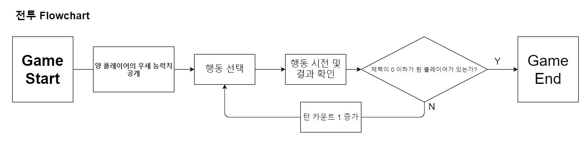

# 밸런스 테스트 실험을 위한 모의 게임 기획서

#### 작성자 : 임용식

---

#### 목차

1.  게임 개요
    1.  개요
    2.  플랫폼
    3.  장르
    4.  기획 의도
    5.  설정
    6.  진행 방식
    7.  승리 방식

2.  게임 시스템
    1.  캐릭터 시스템

        1.  캐릭터 시스템 개요

        2.  캐릭터 종류

        3.  캐릭터 스탯
            1.  스탯 시스템 개요

            2.  능력치

            3.  스킬 능력치
            
        
    2.  전투 시스템

        1.  전투 시스템 개요
        
        2.  전투 흐름도
        3.  전투 방식과 판정
        4.  선공과 후공
        5.  공격
        6.  회피
        7.  방어
    8.  스킬 공격
        9.  전투 종료

    3.  스킬 시스템

        1.  스킬 시스템 개요

        2.  스킬 종류
                   1.  정수리 일격
                   2.  빈틈!
                   3.  숨고르기
        3.  스킬 사용 횟수

    4.  랭크 시스템
        1.  개요
        2.  산정 방식

3.  UI 기획
    1.  Intro Scene UI
    2.  Main Scene UI
    3.  Battle Scene UI
    4.  Battle End Scene UI

4.  그래픽 기획
    1.  캐릭터 리소스
    2.  버튼 리소스
    3.  아이콘 리소스

5.  사운드 기획
    1.  버튼 클릭 사운드
    2.  행동별 사운드
    3.  BGM

----

## 1. 게임 개요

### 1.1. 개요

본 게임은 공주대학교 학부융합프로젝트 **'빅데이터를 이용한 게임 내 플레이어들의 분기 선택 데이터 수집 및 분류와 AI분석을 통한 자동 밸런스 패치 제안 기술에 관한 연구'** 의 연구 진행을 위한 모의 실험용 게임입니다.

### 1.2. 플랫폼

Unity Engine 을 이용한 PC 기반 게임으로 제작됩니다.

### 1.3. 장르

2.5D Isometric View 시점의 턴제 전략 게임입니다.

### 1.4. 기획 의도

본 게임은 전체 연구에서 AI가 수집한 데이터를 분석해 밸런스 패치를 적용하는 대상이 되는 게임이므로 다음과 같은 기획 의도가 반영되었습니다.

*   게임은 최소 2인 이상의 플레이어가 동시에 플레이해야 한다.
*   게임의 최종 목적은 유일해야 한다.
*   해당 목적의 달성을 위해 플레이어가 다양한 전략 수립을 유도하도록 해야 한다.
*   한정된 연구 기간 내 최대한 많은 데이터를 산출할 수 있도록 설계되어야 한다.

### 1.5. 설정

본 게임 내에서, 플레이어와 상대 플레이어(또는 AI)는 한 명의 전사로서, 다른 플레이어와의 전투에서 승리해야 합니다.

### 1.6. 진행 방식

전투를 시작하기 전에 각 플레이어(또는 AI)는 캐릭터에 주어진 스탯 포인트를 배분해야 합니다. 배분할 스탯은 능력치와 스킬 능력치로 나뉘며, 능력치는 총 25point, 스킬 능력치는 총 5point를 배분합니다.

스탯 포인트의 배분이 끝나면 매칭을 통해 상대를 정한 후, 상대와의 전투를 시작합니다. 전투는 턴제 형식으로 진행되며, 매 턴마다 플레이어는 

*   공격
*   스킬 공격
*   방어

중 하나의 행동을 취해야 합니다.

능력치의 상대적 차이에 따라 행동의 선/후 및 결과가 결정되며, 이러한 턴을 계속 진행시켜 나갑니다.

### 1.7. 승리 방식

양 플레이어가 매 턴마다 선택한 행동을 반복하는 도중, 한 플레이어의 체력이 0 이하가 될 경우 먼저 체력이 0 이하가 된 플레이어가 패배, 그렇지 않은 플레이어가 승리하게 됩니다.

----

## 2. 게임 시스템

### 2.1. 캐릭터 시스템

#### 2.1.1. 개요

캐릭터 시스템은 각 플레이어(또는 AI)가 조종하는 대상이 되는 '캐릭터'에 대한 시스템입니다.

#### 2.1.2. 캐릭터 종류

본 게임에서 플레이어와 상대 플레이어는 고정된 하나의 캐릭터가 주어집니다.

*   플레이어 = 오크 전사
*   상대 플레이어 = 인간 전사

캐릭터 모델은 상대적으로 제공됩니다. 즉, 플레이어의 시점에서는 자신의 캐릭터가 **오크 전사**로 보이지만 상대의 시점에서는 자신의 캐릭터가 **인간 전사** 로 보입니다.

#### 2.1.3. 캐릭터 스텟

##### 2.1.3.1 스텟 시스템 개요

캐릭터 스텟은 각 플레이어(또는 AI)가 게임 매칭 전 배분해야 하는 포인트를 말합니다.

본 게임에서 캐릭터 스텟은 2 종류로 구분되며 다음과 같습니다.

*   능력치
*   스킬 능력치

각 종류마다 투자할 수 있는 총 포인트는 각각 다음과 같습니다.

*   능력치 스텟 포인트 - 25Points
*   스킬 스텟 포인트 - 5Points

포인트 배분 시 다음과 같은 규칙이 적용됩니다.

*   능력치 스탯 포인트의 경우 한 능력치에 10Point를 초과하여 투자할 수 없다.
*   스킬 스탯 포인트의 경우 한 능력치에 3Point를 초과하여 투자할 수 없다.

>   예를 들어, 한 플레이어가 A,B,C,D 능력치에 각각 8,8,6,3 Point를 투자하는 것은 허용되지만, 12,5,5,3 Point를 투자하는 것은 허용되지 않습니다.
>
>   마찬가지로 X,Y,Z 스킬에 각각 3,1,1 Point를 투자하는 것은 허용되지만, 4,1,0 Point를 투자하는 것은 허용되지 않습니다.

##### 2.1.3.2 능력치

능력치는 각 플레이어가 능력치 스탯 포인트를 배분할 수 있는 대상입니다.

능력치는 총 4가지가 존재하며, 다음과 같습니다.

*   근력(STR)

    근력(STR)은 캐릭터의 공격력(상대 플레이어에게 입히는 데미지)에 영향을 미치는 능력치입니다.

*   순발력(AGI)

    순발력(AGI)은 한 게임에서 일어나는 행동의 선/후공과 회피 확률에 영향을 미치는 능력치입니다.

*   체력(VIT)

    체력(VIT)은 캐릭터의 체력에 영향을 미치는 능력치입니다.

*   완력(DEF)

    완력(DEF)은 캐릭터의 방어력(받는 데미지량)에 영향을 미치는 능력치입니다.

##### 2.1.3.3 스킬 능력치

스킬 능력치는 각 플레이어가 스킬 능력치 스텟 포인트를 배분할 수 있는 대상입니다.

스킬 능력치는 총 3가지가 존재하며 다음과 같습니다.

*   정수리 일격
*   빈틈!
*   숨고르기

게임 내에서 각 스킬의 사용 가능 횟수는 투자한 스탯 포인트와 동일합니다.

>   예를 들어, X,Y,Z 스킬에 각각 2,1,2 Point를 투자했다면 한 게임 내에서 X,Y,Z 스킬은 각각 2,1,2번 사용할 수 있습니다.

### 2.2. 전투 시스템

#### 2.2.1 개요

전투 시스템은 매칭된 게임에서 진행되는 '전투'에 대한 시스템입니다.

'전투'란 본 게임에서 각 플레이어가 목적(게임의 승리)을 달성하기 위해 행하는 모든 행동들의 과정을 칭합니다.

#### 2.2.2. 전투 흐름도

본 게임의 전투 과정을 흐름도로 나타내면 다음과 같습니다.

#### 2.2.3 전투 방식과 판정

모든 전투는 턴 단위로 진행되며, 각 턴마다 30초의 시간 제한 안에 양 플레이어는 해당 턴에 실행할 행동을 결정합니다.

양 플레이어 모두 행동을 결정한 경우 순차적으로 행동이 시전되며 각 행동이 시전된 직후 해당 행동의 결과가 캐릭터에게 적용됩니다.

이 떄 행동들의 결과가 적용되는 순서를 **판정**이라고 합니다.

전투에서의 판정은 다음과 같습니다.

*   선공의 공격, 스킬 공격과 후공의 회피, 방어는 동일하게 판정된다.
*   후공의 공격, 스킬 공격과 선공의 회피, 방어는 동일하게 판정된다.
*   한 턴에 양 플레이어가 모두 체력이 0 이하가 되는 경우 후공 플레이어가 패배한다.

#### 2.2.4 선공과 후공

전투에서 각 턴은 양 플레이어의 행동을 동시에 시행하게 되므로 어느 플레이어의 행동을 먼저 시전할 지를 정하게 됩니다.

양 플레이어가 공격/스킬 공격 행동을 선택했을 때, 선택한 행동을 먼저 시전하는 것을 **선공**, 선공 플레이어가 시전한 후 시전하는 것을 **후공**이라고 합니다.

공격 순위에 영향을 받는 행동은 다음과 같습니다.

*   공격
*   스킬 공격

공격 순위에 영향을 받지 않는 행동은 다음과 같습니다.

*   회피
*   방어

#### 2.2.5 공격

공격은 상대 캐릭터에게 데미지를 입힐 수 있는 가장 기본적인 행동입니다.

공격 행동에 따른 데미지 공식은 다음과 같습니다

$$
D = 0.9*(STR-DEF)-0.5*DEF*isD+10+rand(-3,3)\quad\quad\quad(STR = 공격자의\,근력, DEF = 피공격자\,완력,\, isD = 피공격자의\,\,방어\,유무)
$$
한 플레이어가 공격 행동을 시전한 경우, 다른 플레이어는 3가지 행동 중 하나를 자동으로 시전합니다.

*   피격

    방어 행동을 선택하지 않은 상태에서 회피에 실패할 경우

*   방어

    방어 행동을 선택한 경우

*   회피

    방어 행동의 선택 유무와 상관없이 회피에 성공한 경우

#### 2.2.6 회피

모든 플레이어는 상대 플레이어가 공격을 시도할 시 회피 함수의 값을 산출받습니다.

회피 함수의 공식은 다음과 같습니다.
$$
y =
\begin{cases}
0 \quad(range\,\,in\,\,0.7*rand(0,(10-AGI))\\1\quad(range\,\,in\,\,0.7*rand((10-AGI+1),AGI)
\end{cases}\quad(AGI = 피공격자\,순발력)
$$

#### 2.2.7 방어

방어는 상대 플레이어의 공격으로부터 최소한의 피해를 입힐 수 있는 행동입니다.

방어 행동을 선택할 시 공격 함수의 isD값이 0에서 1로 변경됩니다.

#### 2.2.8 스킬 공격

스킬 공격은 세 가지의 스킬을 시전하는 것을 통칭합니다.

본 게임의 스킬은 총 세 가지가 존재합니다.

*   정수리 일격
*   빈틈!
*   숨고르기

각 스킬의 자세한 세부 공식은 **스킬 시스템 기획**을 참고하세요.

#### 2.2.9 전투 종료

양 플레이어가 매 턴을 진행하는 과정에서 한 플레이어가 체력이 0 이하가 되는 순간 게임이 종료되며, 이를 **전투 종료**라 합니다.

전투 종료 시 먼처 체력이 0 이하가 된 플레이어가 패배하며, 그렇지 않은 다른 플레이어가 승리하게 됩니다.

----

### 3. 스킬 시스템

#### 3.1. 스킬 시스템 개요

스킬 시스템은 전투에서 플레이어가 사용할 수 있는 스킬 공격에 대한 시스템입니다.

#### 3.2. 스킬 종류

본 게임에서 스킬은 총 세 가지가 존재합니다.

*   정수리 일격
*   빈틈!
*   숨고르기

##### 3.2.1 정수리 일격

**정수리 일격** 스킬은 상대 플레이어의 방어력을 무시하고 강력한 데미지를 입힐 수 있는 스킬입니다.

정수리 일격의 데미지 공식은 다음과 같습니다.
$$
D = 1.2*(STR)+10+rand(-3,3)\quad\quad\quad(D = Damage,\,\,\,\,STR = 공격자의\,근력)
$$

정수리 일격 스킬은 회피가 가능합니다.

##### 3.2.2. 빈틈!

**빈틈!** 스킬은 상대 플레이어에게 약한 공격을 시도한 후 상대 플레이어가 회피를 시도할 시 강력한 데미지를 한 번 더 입힐 수 있는 스킬입니다.

**빈틈!** 스킬의 데미지 공식은 다음과 같습니다.
$$
D_1 =0.5*ATK+1\quad\quad\quad\quad\quad\quad\quad\quad\quad\quad\quad\quad\quad\quad\quad\\D_2 = ATK+12\quad(D_1 = 약한\,공격,\,\,D_2 = 강한\,공격,\,\,ATK = 공격자의\,\,근력)
$$

#### 3.2.3 숨고르기

숨고르기 스킬은 플레이어 캐릭터의 체력을 회복할 수 있는 스킬입니다.

숨고르기 스킬의 회복량 공식은 다음과 같습니다.
$$
H = 0.4lh+0.7VIT\quad(H = 회복량,\,\,lh = 손실\,체력량,\,\,VIT = 시전자의\,체력\,스탯)
$$

#### 3.3. 스킬 사용 횟수

게임 시작 전 플레이어는 스킬 스탯 포인트를 각 스킬에 투자할 수 있습니다.

게임 내에서 각 스킬의 사용 횟수는 투자한 스킬 스탯 포인트와 동일합니다.

>   예를 들어, 플레이어 A가 다음과 같이 스킬 스탯 포인트를 투자했다고 가정할 경우,
>
>   *   정수리 일격 = 3Point
>   *   빈틈! = 2Point
>   *   숨고르기 = 0Point
>
>   정수리 일격은 총 3회, 빈틈!은 총 2회, 숨고르기는 총 0회 사용할 수 있습니다.

----

